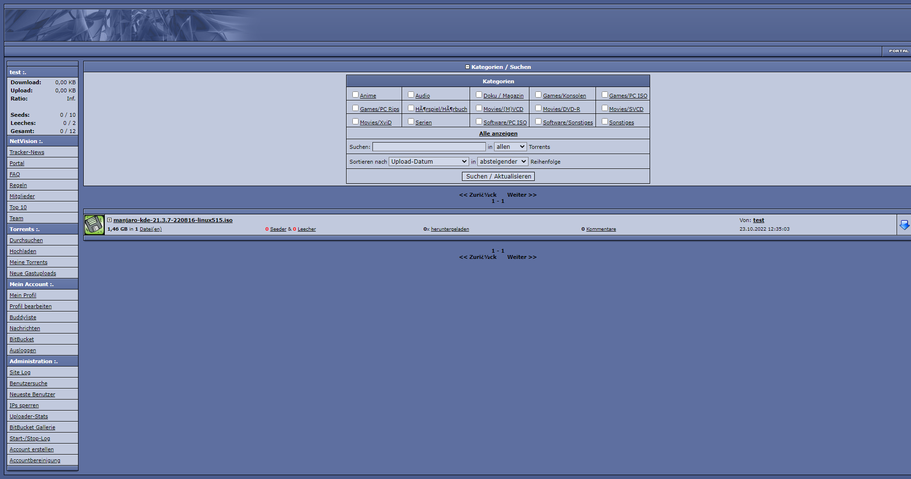
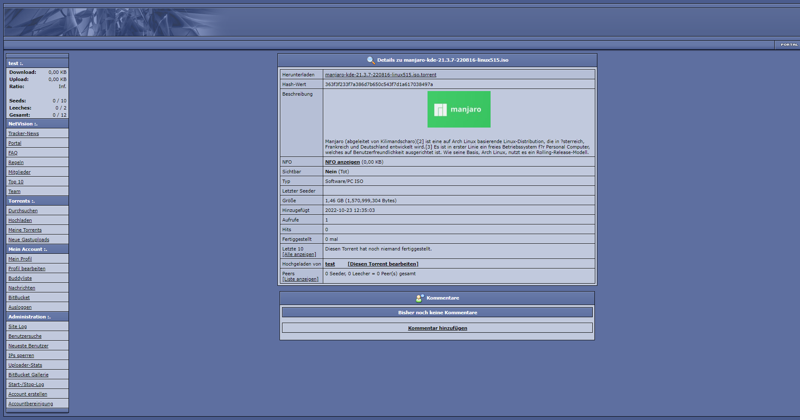
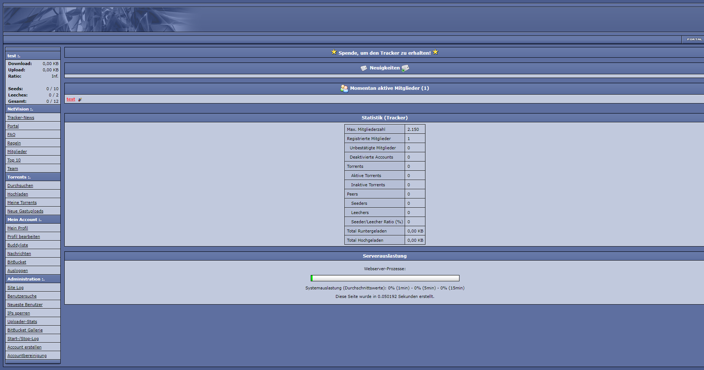
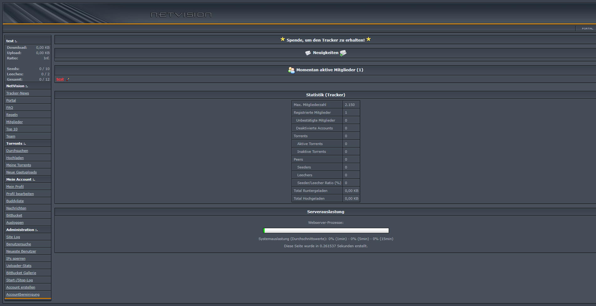

## netvision-tracker

This repository contains a backup of the **unmodified** source code of the NetVision Torrent Tracker from 2006.

# WARNING

This code is VERY outdated and has not been maintained for over 10 years. 
It is provided here for historical purposes only and should not be used in production. 
**NO SECURITY ISSUES HAVE BEEN FIXED**

## Screenshots

## License

[GNU General Public License v2.0](https://choosealicense.com/licenses/gpl-2.0/)
